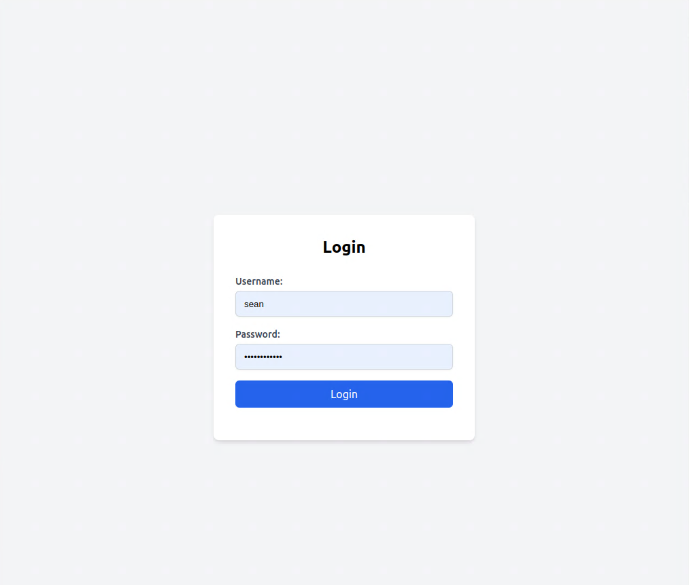
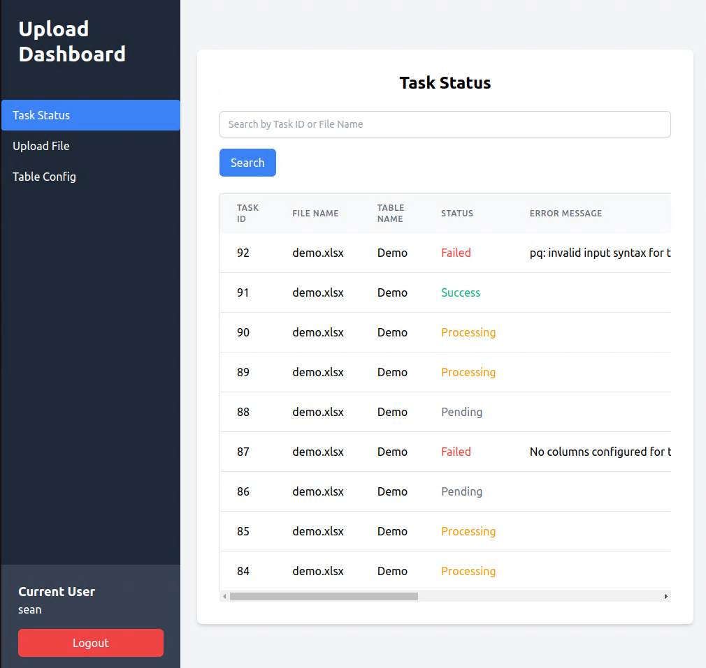
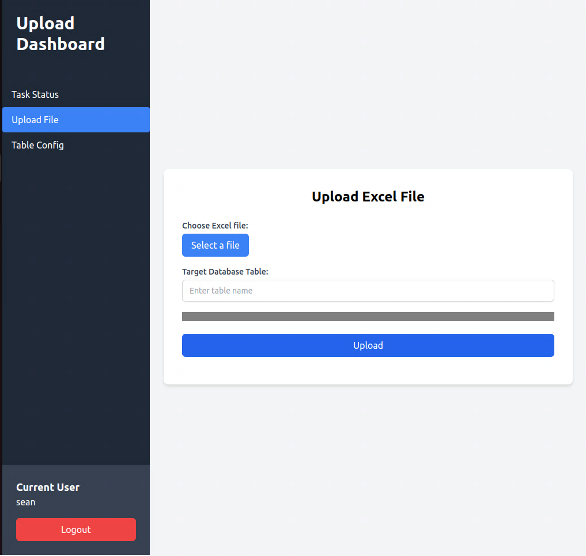
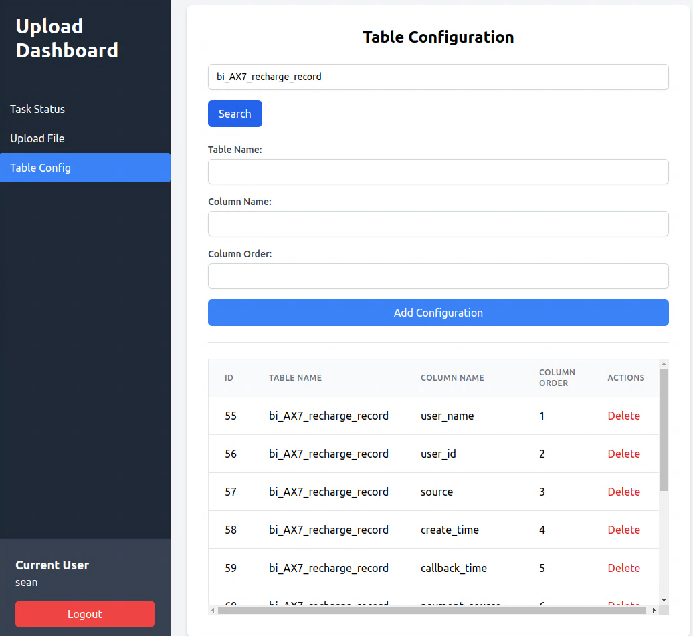

# What's this
> upload your excel to postgresql









# How to build
```shell
   ./build.sh
   docker build -t <yourdocker>/<yourrepo>:<yourtag> .
   docker push <yourdocker>/<yourrepo>:<yourtag>
```

# How to deployment
docker-compose.yaml
```yaml
version: '3.8'

services:
  app:
    restart: always
    image: <yourdocker>/<yourrepo>:<yourtag>
    container_name: excel2pg_app
    environment:
      GIN_MODE: release
      DB_USER: db_user
      DB_PASSWORD: db_pwd
      DB_NAME: db_name
      DB_HOST: db_host
      DB_PORT: 5432
      DB_SSLMODE: disable
    ports:
      - "80:7777"
    networks:
      - excel2pg_network

networks:
  excel2pg_network:
    driver: bridge
```